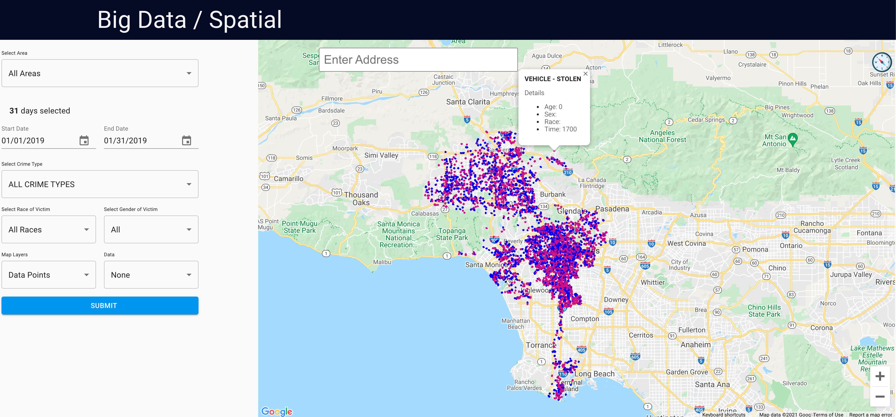
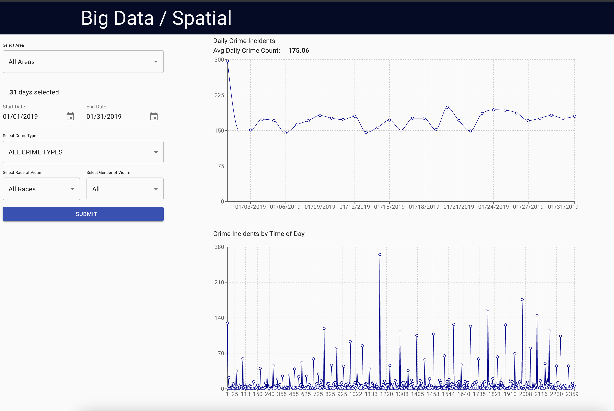

# Spatial Crime Analysis

Given the rise of technologies and tools relating to the Spatial field. It has opened a gateway to
a   huge   number   of   applications   that   can   be   created.   One   such   application   is   Spatial   and
temporal analysis of crime data. The user can be a common citizen looking for places to move,
the police department can use it for focusing on crime-prone areas, even store owners can find
out which location needs more security investments. Here we have created a web application
that depicts the points of different crime locations over a map. It provides various metrics like
the type of crime, time of the crime, sex of victim, etc. We fetched data from Twitter as well as
the government website. We are processing them using Spark SQL, creating REST API calls
using Flask, using NodeJS and ReactJS in the frontend for visualization and analysis.

## Getting Started

Each subfolder has it's own read me file that helps with running the crawler, frontend, and backend services. You will need to have both backend and frontend services running.

### Crawler - [Readme](./tweepy/README.md)
### FrontEnd - [Readme](./spatial-app/README.md)
### BackEnd - [Readme](./backend/README.md)

## Preview
The app allows for the user to submit various types of queries to the backend, the server will return the results to the front to render all points for the given set of data allowing for the user to visually analyse the data.

In addition to the visualization of the data, the app provides and analysis section that will allow the user to submit similar queries to be able to review the data from a analytic view.

## Development
